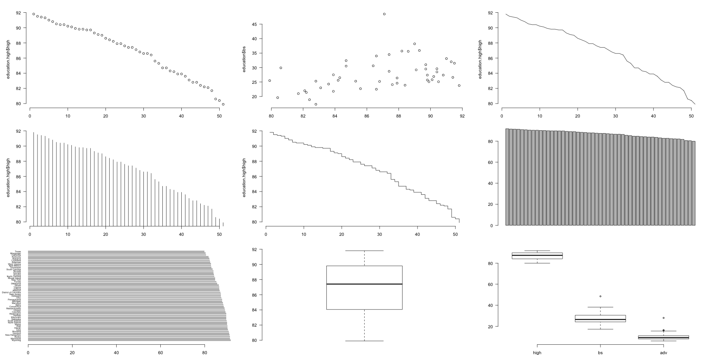
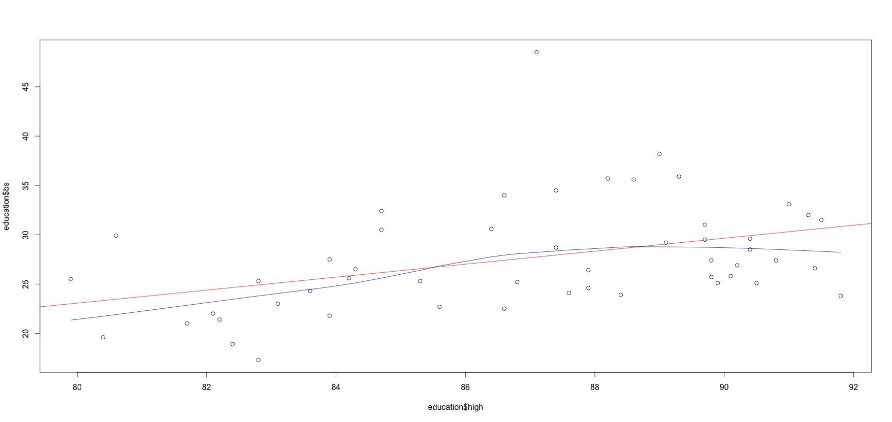

# Exploratory Data Analysis Workshop
***
This repo is meant as a follow up for the EDA workshop by Developers Guatemala.

## R Basics
***
### RTM
* Main Site: [R-Project](http://www.r-project.org)
* Local Docs: ```?data.frame```

### Variables and Data Types
**Types**
* char
* factors = integer vectors with labels, used to represent categorical data.
* vectors = only on type allowed
* lists = allows multiple types
* data frame = allows multiple types, two dimensional data, similar to CSV.

**Common differences:**
* Value assignment: ```x <- 100```
* Concatenation: ```paste("Hello", "World", "!")```
* Vectors based on 1 not 0.

**Data Structures**
* Create a vector: ```my_vector = c(1:100)```
* Create a list: ```my_list = list("hello", 50)```
* Create a factor vector: ```x <- factor(c("yes", "no", "yes", "no"))```
* Test our factor vector:
```
  x
  [1] yes no yes no
  Levels: no yes

  table(x)
```
* Create a data frame:
```
  col_a <- 1:10
  col_b <- 5:14

  # Error: arguments imply differing number of rows
  column_c <- 6:100

  my_df = data.frame(col_a, col_b)
```

### Index
* To access a value from our vector we can index it with bracket notation:  
```
  my_vect[1] # [1] 1
  my_vect[1:4] # [1] 1 2 3 4
  my_vect[c(4,10)] # [1] 4 10
```
* Accessing two dimensional data structures we can use a comma separated index.
```
  my_df[,1]   # First column vector
  my_df[1,]   # First row as list
  my_df[1,1]  # Value from first column and row
  my_df[1:2,] # First two rows
```

* We use data frame column naming to reference the columns as independent variables:
```
  my_df$col_a
  my_df$col_b[3:8]
```

### Subsets
Subsetting allows us to access values through a dataset based on a condition such as: ```subset(my_df, col_a > 5)```

### Summaries
* Run the head function to view the first rows of your data: ```head(my_df)```
* Run the summary function to get basic stats from your data. ```summary(my_df)```
* To get a quick summary of the structure run: ```str(my_df)```
* The dim functions returns the rows and columns of a structure: ```dim(my_df)```
* Finally length is self explanatory: ```length(my_def)```

### Extending R
There a re a lot of packages to extend R, when you find one you like install it and add the library as follow:
```
  install.packages("data.table")
  library("data.table")
```

## Plotting

### Read and load data
```
  education <- read.csv("2009education.csv", header=TRUE, sep=",", as.is=TRUE)
```

### Order
Now to get this into a plotting device we can start by ordering our dataset to begin with.

```
high.order <- order(education$high, decreasing=TRUE)
education.high <- education[high.order,]
```

### Plot
Now choose a plotting system and run any of the corresponding functions.
```
plot(education.high$high, type="l")     # Line
plot(education.high$high, type="h")     # High-density
plot(education.high$high, type="s")     # Step
```

If we need to plot more than one variable (most of the time) we can add the data separating it by commas.

```
plot(education$high, education$bs)
```

### Results




### Regression and Lowess
An excellent characteristic of R is the ease of statistical function use. For example, going back to our scatter plot, we might add a linear regression line and a Lowess line as well.  

First of all lets go back to our scatter plot, then we need to fit it to a linear model through a lm function and finally draw the line. We'll through a Lowess smoother in there which is uses locally-weighted polynomial regression.

```
# Scatter plot
plot(education$high, education$bs)

# Linear model and regression line
abline(lm(education$bs~education$high), col="red")

# Draw a Lowess line
lines(lowess(education$high, education$bs), col="blue")
```


